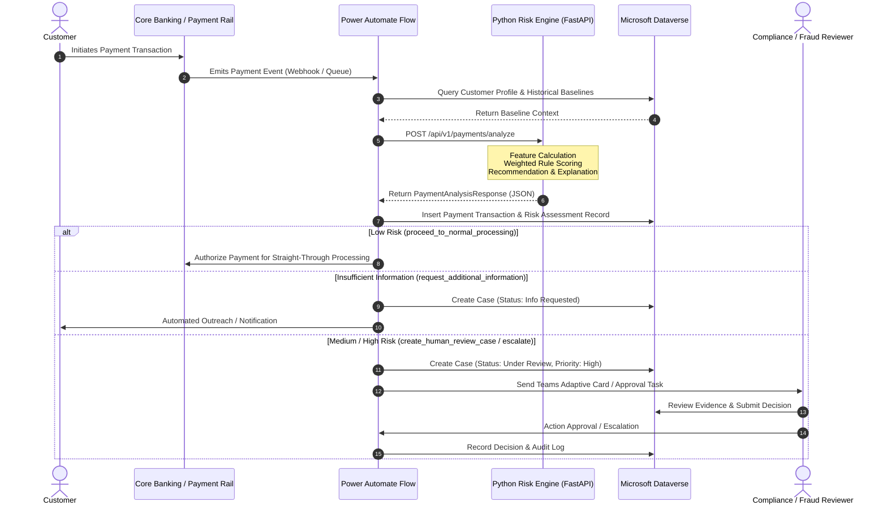

# System Architecture: Payment Review Automation

## 1. Overview

The **Payment Review Automation** system is an intelligent decision-support platform designed for financial services institutions. It assists compliance analysts, payment operations officers, and fraud investigators by evaluating transaction context, calculating transparent risk indicators, generating auditable explanations, and proposing workflow recommendations.

```
+-----------------------------------------------------------------------------------+
|                              FINANCIAL SERVICE SYSTEM                             |
|                                                                                   |
|  [ Payment Transaction Event ]                                                    |
|                |                                                                  |
|                v                                                                  |
|  [ Power Automate Cloud Flow ] <----+ Context Enrichment                          |
|                |                    | (Core Banking / Historical Dataverse Store) |
|                v                    +---------------------------------------------+
|  [ Python Risk Analysis REST API ]                                                |
|       - Feature Engine                                                            |
|       - Transparent Rule Engine                                                   |
|       - Recommendation Engine                                                     |
|       - Explanation Service                                                       |
|                |                                                                  |
|                v Structured Risk Assessment JSON                                  |
|  [ Power Automate Workflow Branching ]                                            |
|       +-----------------------------+-------------------------------+             |
|       |                             |                               |             |
|       v                             v                               v             |
|  [ Low Risk ]               [ Medium / High Risk ]         [ Missing Context ]    |
|       |                             |                               |             |
|  Straight-Through           Create Dataverse Case          Request Additional     |
|  Processing                 & Teams Review Task            Information            |
|       |                             |                               |             |
|       +-----------------------------+-------------------------------+             |
|                                     |                                             |
|                                     v                                             |
|                         [ Dataverse Audit Trail ]                                 |
+-----------------------------------------------------------------------------------+
```

---

## 2. Core Architectural Principles

1. **Intelligent Automation, Not Autonomous Execution**:
   - The Python service calculates risk indicators, scores anomalies, and recommends actions.
   - It **never** executes irreversible fund releases or rejections. The final decision remains with human reviewers or predefined enterprise governance policies.
2. **Transparent and Explainable**:
   - No opaque black-box scoring. Every score is decomposed into explicit feature contributions with human-readable rationale.
3. **Decoupled Responsibilities**:
   - **Python API**: Stateless computation (features, rules, scoring, explainability).
   - **Power Automate**: Workflow orchestration, cross-system connectors, notifications, approval lifecycle.
   - **Microsoft Dataverse**: Relational operational data store, case management, and regulatory audit logging.
   - **Reviewers**: Domain oversight, investigation, and final disposition.

---

## 3. End-to-End Sequence Flow



---

## 4. Component Responsibilities

| Component | Technology | Primary Responsibilities |
| :--- | :--- | :--- |
| **Risk Analysis Microservice** | Python 3.11+, FastAPI, Pydantic | Data validation, feature extraction, rule-based scoring, explainability generation, REST APIs. |
| **Workflow Orchestration** | Power Automate Cloud Flow | Event triggering, data gathering, calling REST API, conditional branching, human approval tasks. |
| **Case & Audit Store** | Microsoft Dataverse | Storing case metadata, payment records, risk breakdowns, reviewer comments, immutable audit trails. |
| **Human Interface** | Power Apps / Teams Adaptive Cards | Review queue interface, case prioritization, required action checklist presentation. |
| **Document Storage** | SharePoint Online | Storing supporting documentation (invoices, identity documents, KYC records). |
