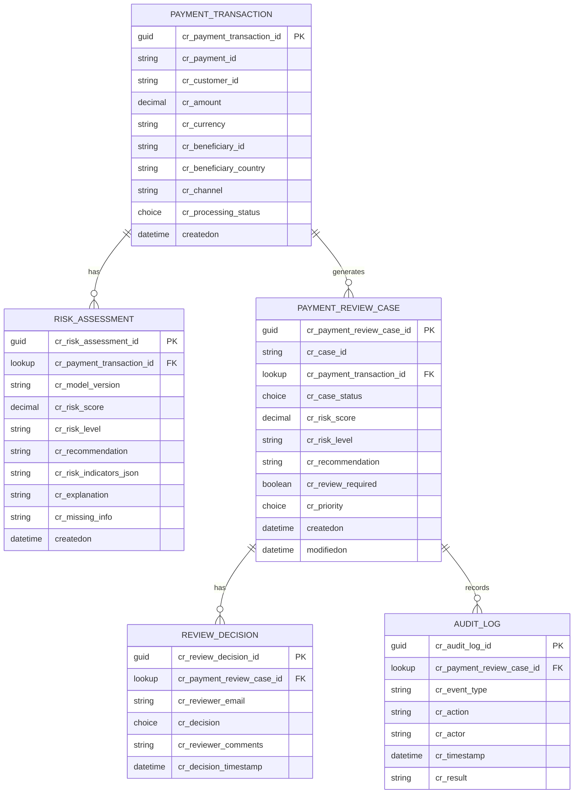

# Microsoft Dataverse Data Model Design

This document specifies the Dataverse relational tables, columns, relationships, and sample records to support the Payment Review Automation ecosystem.

---

## 1. Entity-Relationship Diagram (Dataverse Tables)

---

## 2. Table Specifications

### Table 1: `Payment Review Case` (`cr_payment_review_case`)
| Column Logical Name | Display Name | Data Type | Description |
| :--- | :--- | :--- | :--- |
| `cr_case_id` | Case Identifier | Text (Auto-number) | Case reference (e.g. `CASE-2026-0001`) |
| `cr_payment_transaction_id` | Payment Transaction | Lookup | Relationship to `Payment Transaction` |
| `cr_case_status` | Status | Choice | `New`, `Under Review`, `Info Requested`, `Approved`, `Escalated`, `Closed` |
| `cr_risk_score` | Risk Score | Decimal (2 decimal places) | Normalized risk score (`0.00` - `1.00`) |
| `cr_risk_level` | Risk Level | Choice | `low_risk`, `medium_risk`, `high_risk`, `insufficient_information` |
| `cr_recommendation` | Recommendation | Text | Python recommended action |
| `cr_review_required` | Review Required | Two Options (Boolean) | `Yes` / `No` |
| `cr_priority` | Case Priority | Choice | `Low`, `Medium`, `High`, `Urgent` |

---

### Table 2: `Payment Transaction` (`cr_payment_transaction`)
| Column Logical Name | Display Name | Data Type | Description |
| :--- | :--- | :--- | :--- |
| `cr_payment_id` | Payment Reference | Text | Unique transaction code (e.g. `pay-001`) |
| `cr_customer_id` | Customer ID | Text | Customer account reference |
| `cr_amount` | Amount | Currency / Decimal | Payment amount |
| `cr_currency` | Currency Code | Text (3 chars) | ISO 4217 code (e.g. `USD`) |
| `cr_beneficiary_id` | Beneficiary ID | Text | Payee account code |
| `cr_beneficiary_country` | Beneficiary Country | Text (2-3 chars) | ISO Country Code |
| `cr_channel` | Channel | Choice | `online`, `wire`, `mobile`, `batch` |
| `cr_processing_status` | Processing Status | Choice | `Pending`, `Released`, `Held`, `Rejected` |

---

### Table 3: `Risk Assessment` (`cr_risk_assessment`)
| Column Logical Name | Display Name | Data Type | Description |
| :--- | :--- | :--- | :--- |
| `cr_payment_transaction_id` | Payment Transaction | Lookup | Associated transaction |
| `cr_model_version` | Model Version | Text | e.g. `rule-based-v1` |
| `cr_risk_score` | Risk Score | Decimal | Overall evaluated score |
| `cr_risk_level` | Risk Level | Text | Calculated risk level |
| `cr_risk_indicators_json` | Risk Indicators JSON | Multiple lines of text | Serialized JSON array of triggered indicators |
| `cr_explanation` | Explanation Narrative | Multiple lines of text | Human-readable explanation from Python engine |

---

### Table 4: `Review Decision` (`cr_review_decision`)
| Column Logical Name | Display Name | Data Type | Description |
| :--- | :--- | :--- | :--- |
| `cr_payment_review_case_id` | Payment Review Case | Lookup | Associated case |
| `cr_reviewer_email` | Reviewer Identity | Text / User Lookup | Email of compliance officer |
| `cr_decision` | Final Decision | Choice | `Approve Payment`, `Request More Info`, `Escalate to AML`, `Reject` |
| `cr_reviewer_comments` | Reviewer Rationale | Multiple lines of text | Case notes and justification |
| `cr_decision_timestamp` | Decision Timestamp | Date and Time | Exact moment decision was executed |

---

### Table 5: `Audit Log` (`cr_audit_log`)
| Column Logical Name | Display Name | Data Type | Description |
| :--- | :--- | :--- | :--- |
| `cr_payment_review_case_id` | Payment Review Case | Lookup | Associated case |
| `cr_event_type` | Event Type | Text | `API_EVALUATION`, `ROUTING_DECISION`, `HUMAN_ACTION` |
| `cr_action` | Action Performed | Text | e.g. `Case Assigned to Level 2 Analyst` |
| `cr_actor` | Actor | Text | System account or reviewer identity |
| `cr_timestamp` | Event Timestamp | Date and Time | Immutable audit timestamp |
| `cr_result` | Outcome | Text | Status outcome |
